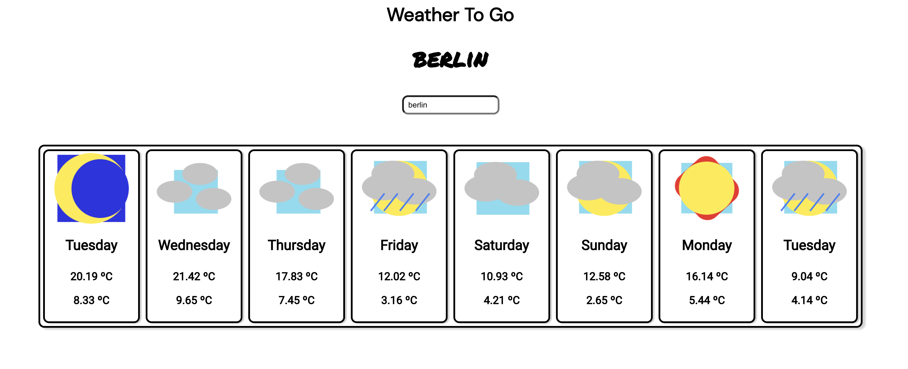

# Welcome to Weather To Go

This is a simple weather app made in React with Typescript using the [OpenWeatherMap API](https://openweathermap.org/api/one-call-api#how).

## Available Scripts

In the project directory, you can run:

### `npm install` - this will install any packages

### `npm start` - this will start the project

### `npm test` - this will run some tests

### `npm run lint` - this will lint any errors related to my linter settings

### `npm run build` - this will build for production, i dont think youll need that. 

### NOTE: Your free openweathermap APIKEY should go in your .env file if you would like to run locally, please refer to the .env.example file.

The App was originally storyboarded in Figma, you can see the designs [here](https://www.figma.com/file/UG53tJM60rPdiTw6LxFqsn/Weather-app?node-id=0%3A1) or in the [screenshots folder](screenshots)

The project is deployed on netlify, you can see a live instance running [here](https://musing-einstein-5bf189.netlify.app/).

## Design Decisions

The app was quickly boostrapped with [Create React App](https://github.com/facebook/create-react-app) with typescript, to get me moving quickly on building.

From the initial design elected to show all the days in one section instead of showing the current day as separate. The current day does however display the current temperature and image depending on time. 

As the open weather map api charges 40$ for a month to get the nice endpoints with longer time scales +town recognition (unless I misread), I simply chained two calls together to save time. Theres certainly other solutions for this, possibly geolocation.

The weather api also allows options for icons for different weather. I elected to design my own simple ones instead.

## Areas for improvement / Extensions
As with any project theres several things that could be improved.

I elected to do the ui from scratch, without using a framework. While i like this decision, it could be optimised more and there is obviously lots of room to improve the design. 

I think the main gap for me right now is the testing and the error handling. I elected to spend a majority of the time building the app and not focus as much on the unit tests/error as I expect only a small range of interactions within the app. In production obviously these would be extended. Full component tests as well as full unit tests (with mocks) for all the functions seem like an immediate improvement.

I would also extend aria-tags and correct any semantic html errors that are still remaining. 

I would consider moving to a css-in-js solution to extend typing to my classes. 

Theres static text as well, which isnt super great and obviously the website is only in english for now. The api does include language support, I would include a dropdown or use current location and include translations for my text with i18n. 

I included eslint to theoretically help me format but my default formatter was fighting with it so I ended up just turning off the spacing, the eslint does help with some other issues though!

Finally I considered a day/night mode. 

Sort of long-winded but I did put a good amount of time into this, even though there are still many things left over!

Thanks!
